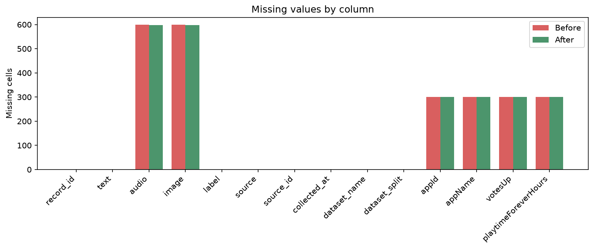
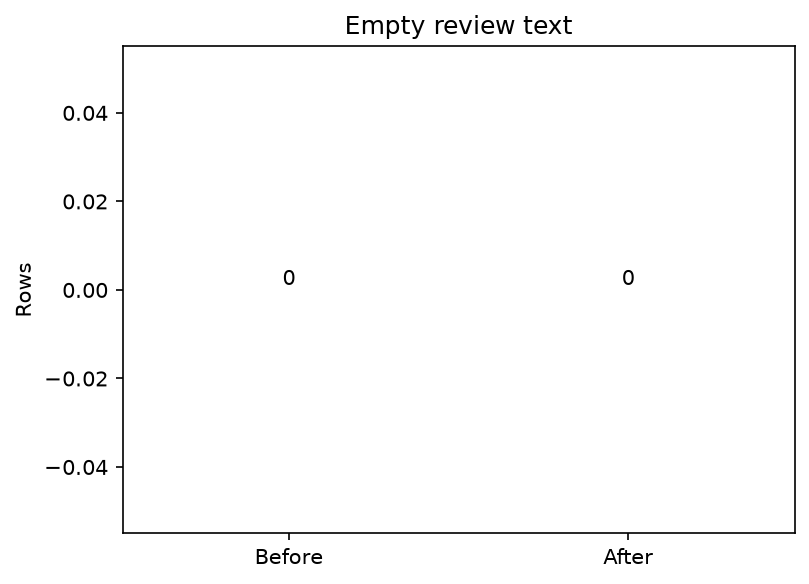
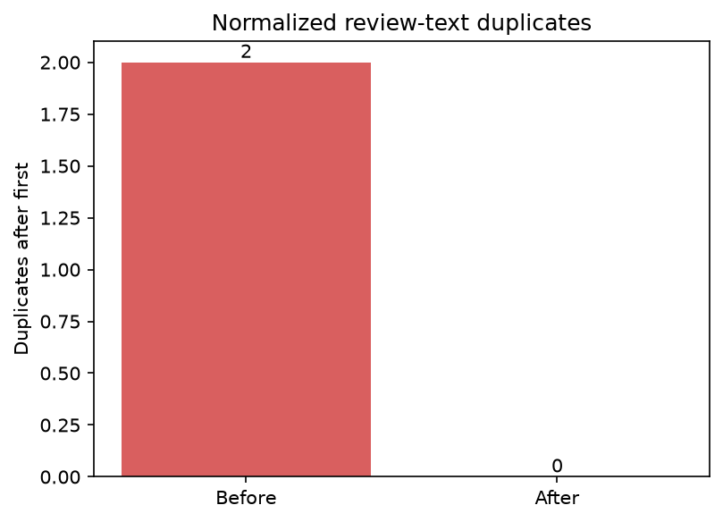
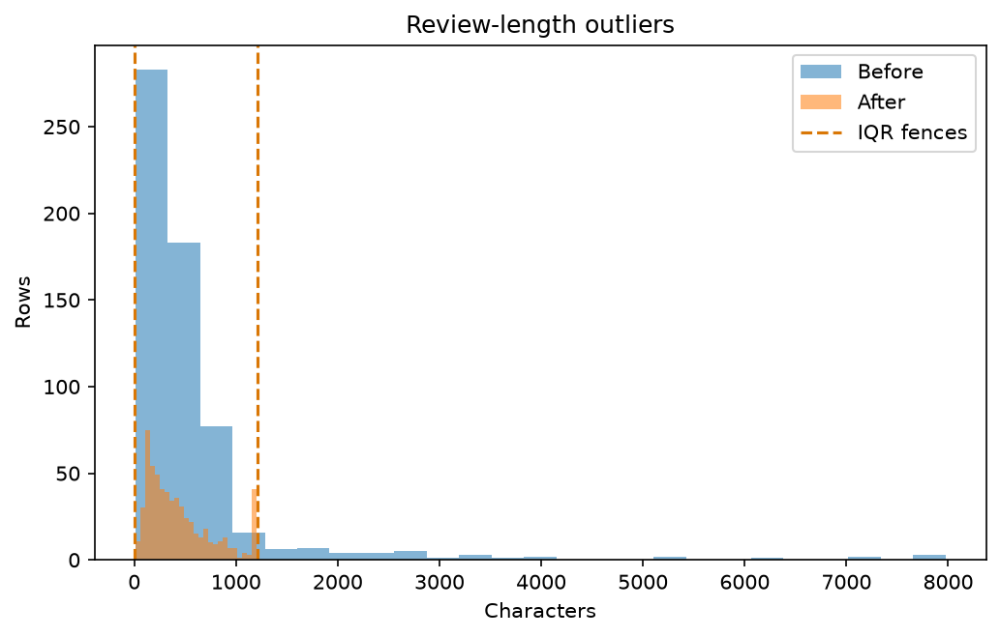
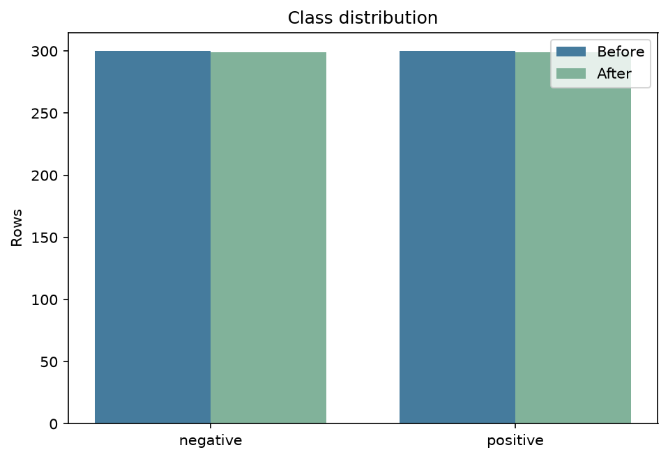

# Data quality report

Generated: `2026-08-30T14:10:19.402822+00:00`  
Strategy: `conservative`

## Summary

- Rows: 600 → 598
- Missing cells: 2400 → 2396
- Empty texts: 0 → 0
- Exact duplicates: 0 → 0
- Normalized-text duplicates: 2 → 0
- IQR length outliers: 42 → 0
- Z-score length outliers: 13 → 0

## Before / after

| metric | before | after | change | improved |
| --- | --- | --- | --- | --- |
| rows | 600.0000 | 598.0000 | -2.0000 | — |
| missing_cells | 2400.0000 | 2396.0000 | -4.0000 | True |
| rows_with_missing | 600.0000 | 598.0000 | -2.0000 | True |
| empty_text | 0.0000 | 0.0000 | 0.0000 | False |
| exact_duplicates | 0.0000 | 0.0000 | 0.0000 | False |
| normalized_text_duplicates | 2.0000 | 0.0000 | -2.0000 | True |
| text_length_iqr_outliers | 42.0000 | 0.0000 | -42.0000 | True |
| text_length_zscore_outliers | 13.0000 | 0.0000 | -13.0000 | True |
| class_balance_ratio | 1.0000 | 1.0000 | 0.0000 | False |
| target_count:negative | 300.0000 | 299.0000 | -1.0000 | — |
| target_share:negative | 0.5000 | 0.5000 | 0.0000 | — |
| target_count:positive | 300.0000 | 299.0000 | -1.0000 | — |
| target_share:positive | 0.5000 | 0.5000 | 0.0000 | — |

## Strategy rationale

The conservative strategy removes unusable required-field rows and normalized-text duplicates, while retaining short reviews and truncating only the unusually long tail. This preserves more domain coverage for sentiment classification. Strategy name: conservative. Target-distribution total variation before versus after is 0.0000; labels themselves were never rewritten.

The cleaning stage never imputes, normalizes, or overwrites `label`,
`source_label`, `auto_label`, `human_label`, or `final_label`. A distribution can
change only when a complete record is removed. The measured target-distribution
shift is recorded in `quality_report.json`.

## Visual diagnostics

